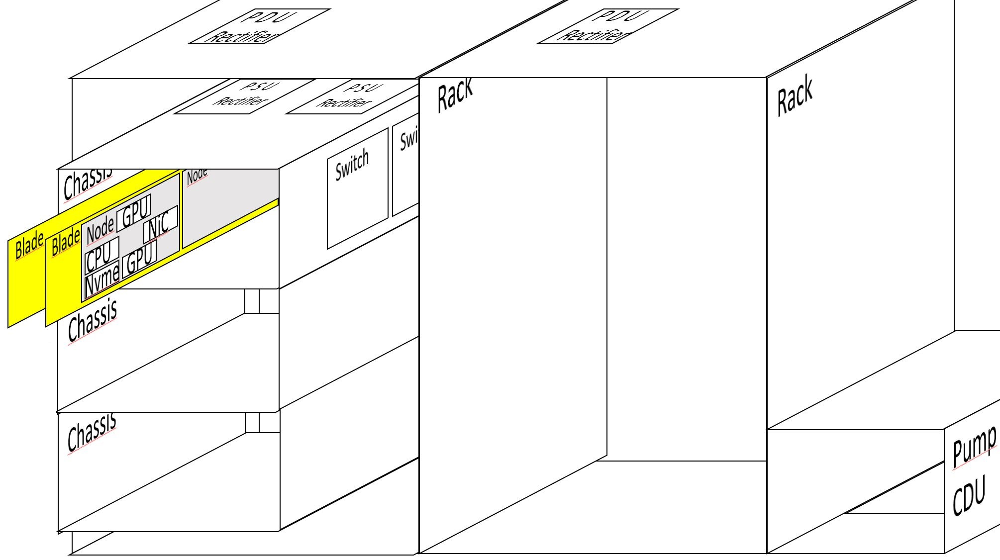

Resource Allocator and Power Simulator (RAPS)
===========================================================

RAPS is one of the modules used by the ExaDigiT framework.
RAPS is a python code that either simulates workloads or replays historical workloads from system telemetry, and is able to predict dynamic energy consumption, as well as interact with the cooling model to predict cooling system behavior. Such a tool can be used together with reinforcement learning algorithms to provide an end-to-end optimization tool for data centers.

Installation
------------

.. code-block:: shell-session

   # Requires Python version >= 3.9
   $ git clone https://code.ornl.gov/exadigit/raps
   $ cd raps
   $ pip install -e .

Quickstart
----------
.. code-block:: shell-session

   # Download dataset (270MB) related to Marconi supercomputer
   $ wget https://zenodo.org/records/10127767/files/job_table.parquet
   $ python main.py --system marconi100 -f job_table.parquet

   
Command line flags
------------------

.. literalinclude:: RAPS.usage.txt
  :language: shell

Describing your supercomputer
-----------------------------------

Three files are mandatory for describing your supercomputer in the raps/config/<mysupercomputer> directory. The file system.json describing the hardware layout, the file power.json describing the power characteristics and the file scheduler.json describing the computing jobs.

Racks and their content
^^^^^^^^^^^^^^^^^^^^^^^

   

In the raps/config/<mysupercomputer>/ directory create a system.json file.
Here from the exploded view of a naive supercomputer, we have:

- 1 CDU pump cooling 2 racks
- 1 PDU rectifier per rack
- 3 chassis per rack
- 2 switches per chassis
- 2 PSU rectifier per chassis
- 12 nodes per rack
- 2 nodes per blade
- 2 nodes per PSU rectifier
- 1 CPU per node
- 2 GPU per node
- 1 High Speed NiC per node
- not written but 1 Disk/NVME per node is supposed

  
That corresponds to a file  raps/config/<mysupercomputer>/system.json containing:
 .. literalinclude:: raps/system.json
  :language: shell

Here are the descriptions of each field:

- NUM_CDUS: total number of pumps
- RACKS_PER_CDU: number of racks managed by one pump
- RECTIFIERS_PER_RACK: number of PDU rectifier per rack
- CHASSIS_PER_RACK: number of chassis/enclosures in each rack
- SWITCHES_PER_CHASSIS: number of high speed network switches
- RECTIFIERS_PER_CHASSIS: number of PSU per chassis
- NODES_PER_RACK: total number of nodes in each rack
- NODES_PER_BLADE: number of nodes in each blade
- NODES_PER_RECTIFIER: number of nodes managed by each PSU
- CPUS_PER_NODE: number of socket/CPU in each node
- GPUS_PER_NODE: number of GPU in each node
- NICS_PER_NODE: number of high speed network cards in each node 
- MISSING_RACKS: List of numbers indicating which rack is missing
- DOWN_NODES: List of numbers indicating which node is down
- CPU_PEAK_FLOPS: Floating value indicating the peak Flops of each CPU
- GPU_PEAK_FLOPS: Floating value indicating the peak Flops of each GPU
- CPU_FP_RATIO: Floating value between 0 and 1, used to linearly decrease the peak CPU Flops according to the number of Watts consumed
- GPU_FP_RATIO: Floating value between 0 and 1, used to linearly decrease the peak GPU Flops according to the number of Watts consumed

Racks and their powering
^^^^^^^^^^^^^^^^^^^^^^^^^^^
  
Here is an example of a file  raps/config/<mysupercomputer>/power.json for the Frontier supercomputer:

 .. literalinclude:: raps/power.json
  :language: shell

Description of fields
             
- POWER_GPU_IDLE: number of watts consumed by a GPU when idle
- POWER_GPU_MAX: number of watts consumed by a GPU when reaching its peak Flops/s
- POWER_CPU_IDLE: number of Watts consumed by a GPU when idle
- POWER_CPU_MAX: number of Watts consumed by a CPU when reaching its peak Flops/s
- POWER_MEM: average number of Watts consumed by all the memory of all the CPU in a node
- POWER_NIC: average number of Watts consumed by one high speed network card in each node
- POWER_NVME: average number of Watts consumed by all the disks/NVME in each node
- POWER_SWITCH: average number of Watts consumed by one high speed network switch in each chassis
- POWER_CDU: average number of Watts consumed by one CDU in each line of racks
- POWER_UPDATE_FREQ: number of seconds between each Watt sample
- RECTIFIER_PEAK_THRESHOLD: number Watts where the current rectifier has its peak of efficiency
- SIVOC_LOSS_CONSTANT: number of Watts lost
- SIVOC_EFFICIENCY: value between 0 and 1 indicating the efficiency
- RECTIFIER_LOSS_CONSTANT: number of Watts lost
- RECTIFIER_EFFICIENCY: value between 0 and 1 indicating the efficiency
- POWER_COST: number of US Dollars per KW.h consumed

Jobs and their contents
^^^^^^^^^^^^^^^^^^^^^^^

Here is an example of a file  raps/config/<mysupercomputer>/scheduler.json for the Frontier supercomputer:

 .. literalinclude:: raps/scheduler.json
  :language: shell

Description of fields:
             
- SEED: integer used to initialize the random number generator
- JOB_ARRIVAL_TIME: offset in number of seconds to calculate the arrival time of the next randomly generated job
- MTBF: Mean Time Before Failure of a node
- MAX_TIME:  Maximum  physical time (in seconds) simulated 
- TRACE_QUANTA: number of second between each energy sampling
- MIN_WALL_TIME: number of seconds of the smallest possible job randomly generated
- MAX_WALL_TIME: number of seconds of the biggest possible job randomly generated
- UI_UPDATE_FREQ: Physcal time (in seconds) simulated between each User Interface update
- MAX_NODES_PER_JOB: number of nodes of the biggest jobs
- JOB_END_PROBS: Probability of different ending states for randomly generated jobs (their sum should be equal to 1)
     - COMPLETED: probability between 0 and 1 that this state occurs
     - FAILED": probability between 0 and 1 that this state occurs
     - CANCELLED: probability between 0 and 1 that this state occurs
     - TIMEOUT: probability between 0 and 1 that this state occurs
     - NODE_FAIL: probability between 0 and 1 that this state occurs

  
RAPS python input data format
----------------------------------

RAPS requires a certain amount of data on a series of jobs in order to function.  

This requires a list of jobs, where each job has the following information (as a job_dict structure described below):

- **Number of nodes** : used by the job (integer)
- **Name** : job name (string)
- **Cpu_trace** : either a trace in the granularity of a trace quanta, or a single value , either in the range [0,N_CPUs]
- **Gpu_trace**  : same as cpu_trace, either a list/np.ndarray of floats or a single float, either in the range  [0,N_GPUs]
- **Wall_time** : job duration in seconds (integer)
- **State** : completion state at the end of the job (String)
- **Scheduled_nodes** : list of nodes assigned to the job or None (by node index) (String)
- **Time_offset** : the submit time, or when the job enters the queue
- **job_id** :  (integer or string)
- **priority** : priority of the job (integer)

To read data from your cluster in Raps, you need to declare your cluster and associate a dataloader with it. Dataloader will format the data from your cluster in raps format.

The power utilization is computed from the **cpu_trace** and **gpu_trace** and each value in the trace is a percentage between 0 and N_CPUs / 0 and N_GPUs respectively.

If the trace (CPU and GPU) provides a single value, constant utilization is assumed for the duration of the job.

Given these trace values the power is computed given:

**raps/config/frontier/power.json** (Needs to be created to for your system, while enabling your system with the --system cli parameter)

This means that you need to look up the configuration of your system and adjust these values.

Everything but CPU and GPU is considered constant at the moment.
  
.. code-block:: shell-session

   def job_dict(nodes_required, name, cpu_trace, gpu_trace, wall_time, \
             end_state, scheduled_nodes, time_offset, job_id, priority=0):
       """ Return job info dictionary """
       return {
           'nodes_required': nodes_required,
           'name': name,
           'cpu_trace': cpu_trace,
           'gpu_trace': gpu_trace,
           'wall_time': wall_time,
           'end_state': end_state,
           'requested_nodes': scheduled_nodes,
           'submit_time': time_offset,
           'id': job_id,
           'priority': priority
       }

Developpers
-----------

Brewer Wesley, Maiterth Mathias, Bouknight Sedrick, Hines Jesse, Webb Tyler
