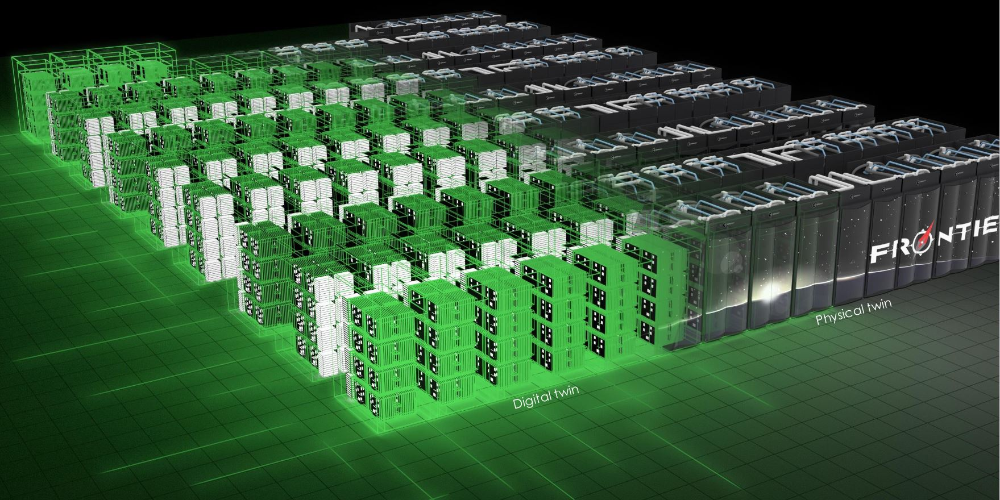

.. ExaDigiT documentation master file, created by
   sphinx-quickstart on Wed Apr 24 22:19:44 2024.
   You can adapt this file completely to your liking, but it should at least
   contain the root `toctree` directive.

   
ExaDigiT documentation
====================================

ExaDigiT is a digital twin of supercomputers and their thermal infrastructures. It offers insights into operational strategies, "what-if" scenarios, as well as elucidates complex, cross-disciplinary transient behaviors. It also serves as a design tool for future system prototyping.
It combines telemetry and simulations, providing a virtual representation of physical systems. It supports planning, construction, and operations, offering value in decision-making, predictive maintenance, and system efficiency. In design stages, it can evaluate energy efficiency, virtually prototype cooling systems, and model network performance. During operations, ExaDigiT aids in predictive maintenance and operational optimization.

ExaDigiT is built on an open software stack (Modelica, SST Macro, Unreal Engine) with an aim to foster community-driven development, we have formed a partnership with national supercomputer centers (ORNL, LLNL, LANL (USA), PAWSEY (Australia), LUMI (Finland), CINES (France) , CINECA (Italy), ...) around the world to develop an open framework for modeling supercomputers.

ExaDigiT uses four primary components:
---------------------------------------

    - **RAPS**: Resource Allocator and Power Simulator (https://code.ornl.gov/exadigit/raps) to model workloads, energy usage, and energy conversion losses.

    - **Cooling Model with Modelica FMU** (AutoCSM https://code.ornl.gov/exadigit/AutoCSM, LBNL https://github.com/lbl-srg/modelica-buildingsL, TRANSFORM https://github.com/ORNL-Modelica/TRANSFORM-Library) transient thermo-fluid simulation to model the cooling system from the cooling tower to the cold plate.

    - A network digital twin to simulate network power and congestion.

    - **ExaDigiTUE5**: A visual analytics module (https://code.ornl.gov/exadigit/exadigitue5) using Unreal Engine 5 for augmented reality and a web-based dashboard for experiments.

    
         
.. toctree::
   :maxdepth: 1
   :hidden:

   RAPS
   coolingModel
   NetworkDT
   ExaDigiTUE5

