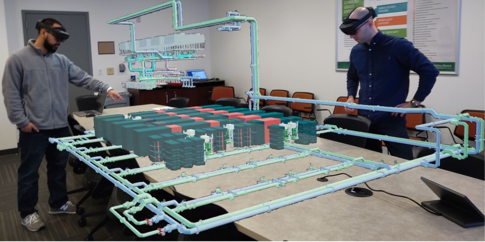

ExaDigiTUE5 
================================

ExaDigiTUE5 provides the AR/VR interface to ORNL's exascale digital twin.
The main functionality is implemented using Unreal Engine 5.1 for Desktop or
Microsoft Hololens2 based visualization and interation with the system.
The digital twin provides data ingestion from telemetry, as well as triggering
and interacting with simulations developed for the wider ExaDigiT project at
ORNL, as well as for the LUMI system at CSC and other CrayEX Supercomputers.
For the overarching project, see ExaDigiT at https://exadigit.github.io,
with the code repositories at https://code.ornl.gov/exadigit.

Installation
------------

First install Unreal Engine 5.1.
To be part of the EpicGames Organization and have access to https://github.com/EpicGames/UnrealEngine/tree/5.1  watch the video https://www.youtube.com/watch?v=rldy9yY0yDU or through https://www.unrealengine.com/en-US/download

git clone --recurse-submodules https://code.ornl.gov/exadigit/exadigitue5.git

For UEFMI, which is a plugin to the project follow the installation guide at
https://github.com/ORNL-Modelica/UnrealEngine-FMIPlugin
Especially its contained submodules and fmikit setup! (See README.md#Installation of the project.)

Visualisation
-------------

         
Contributors
------------

Matthias Maiterth, Dane de Wet, Jesse Hines, Scott Greenwood, Sedrick Bouknight

