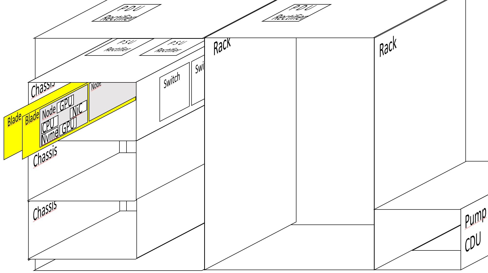

Resource Allocator and Power Simulator (RAPS)
===========================================================

RAPS is one of the modules used by the ExaDigiT framework.
RAPS is a Python code that either simulates synthetic workloads or replays historical workloads from system telemetry, schedules them, and predicts dynamic power and energy consumption. It can also interact with the cooling model to predict cooling system behavior and with a network model to estimate congestion. Such a tool can be used together with reinforcement learning algorithms to provide an end-to-end optimization tool for data centers.

Installation
------------

RAPS requires Python 3.12 or newer.

.. code-block:: shell-session

   $ git clone https://code.ornl.gov/exadigit/raps
   $ cd raps
   $ pip install -e .

This installs the ``raps`` command (equivalent to ``python main.py``). Optional shell tab completion is enabled with ``raps shell-completion``.

Quickstart
----------

Run the default synthetic workload on the default system (Frontier) for one simulated hour:

.. code-block:: shell-session

   $ raps run

Replay open telemetry, here the Marconi100 dataset (270MB):

.. code-block:: shell-session

   $ wget https://zenodo.org/records/10127767/files/job_table.parquet
   $ raps run --system marconi100 -f job_table.parquet

A simulation is described either by command line flags or by a YAML file, and the two can be mixed. The ``experiments`` directory of the repository holds ready-made examples:

.. code-block:: shell-session

   $ raps run experiments/marconi100.yaml
   $ raps show --system marconi100 -t 6h --policy fcfs > my-experiment.yaml   # turn flags into a config

For example ``experiments/marconi100.yaml`` is simply:

.. code-block:: yaml

   system: marconi100
   replay:
     - /opt/data/hpc/marconi100/job_table.parquet

At the end of a run RAPS prints a report of scheduling and power statistics. Unless ``--output none`` is given, power, cooling and loss data (and plots requested with ``-p``) are written to a ``raps-output-<id>`` directory.

Commands
--------

.. list-table::
   :header-rows: 1
   :widths: 20 80

   * - Command
     - Purpose
   * - ``raps run``
     - Simulate a single-partition system with a synthetic workload or a telemetry replay.
   * - ``raps run-parts``
     - Simulate a multi-partition (heterogeneous) system, selected with ``-x``.
   * - ``raps show``
     - Print the effective simulation config as YAML, for reproducing a run.
   * - ``raps workload``
     - Generate a workload and save it as an ``.npz`` snapshot.
   * - ``raps telemetry``
     - Analyze a telemetry dataset, e.g. average job arrival time.
   * - ``raps download``
     - Download telemetry data for a system.
   * - ``raps train-rl``
     - Train a reinforcement learning scheduler (Gym environment based on the simulator).
   * - ``raps shell-completion``
     - Register shell tab completion.

Command line flags
------------------

Every subcommand accepts ``-h``. All simulation options are also available as keys of the YAML config file (with dashes replaced by underscores). The listing below is a summary; ``raps run -h`` shows all flags, including the ``--system.*`` overrides.

.. literalinclude:: RAPS.usage.txt
  :language: shell

Workloads
---------

Synthetic workloads are selected with ``-w``/``--workload``:

- ``random`` (default): random job sizes, wall times and utilizations, drawn from the distributions below.
- ``benchmark``, ``peak``, ``idle``: full-system benchmark style, peak power, and idle test workloads.
- ``synthetic``, ``randomAI``, ``multitenant``: parameterized synthetic and AI-style mixes; ``multitenant`` allows several jobs to share a node.
- ``hpl``, ``calculon``: workloads generated from an HPL model or from Calculon LLM training estimates.
- ``network_test``, ``inter_job_congestion``: synthetic communication patterns for the network model (use with ``--net``).
- ``replay``: selected automatically when ``-f`` is given.

Job sizes, wall times and CPU/GPU utilizations are drawn from ``uniform``, ``weibull`` or ``normal`` distributions, chosen with ``--jobsize-distribution``, ``--walltime-distribution``, ``--cpuutil-distribution`` and ``--gpuutil-distribution`` and tuned with the matching ``-normal-mean``, ``-normal-stddev``, ``-weibull-shape`` and ``-weibull-scale`` flags. Several distributions can be mixed with ``--multimodal``. For example:

.. code-block:: shell-session

   $ raps run -n 500 --seed 1 --jobsize-distribution weibull --jobsize-weibull-shape 0.7 --jobsize-weibull-scale 40

Telemetry replay
----------------

Replay uses ``-f``/``--replay`` with the data location for the chosen ``--system``. The dataloader is looked up as ``raps.dataloaders.<system>`` unless ``--dataloader`` names your own module. Bundled dataloaders:

.. list-table::
   :header-rows: 1
   :widths: 25 75

   * - System
     - Data
   * - ``frontier``
     - OLCF telemetry (``joblive`` and ``jobprofile``, not public), or the public SWF trace via ``frontier_swf`` (scheduler scalars only, no power traces).
   * - ``marconi100``
     - PM100 dataset, ``job_table.parquet`` (https://zenodo.org/records/10127767).
   * - ``adastraMI250``
     - ``AdastaJobsMI250_15days.parquet`` (https://zenodo.org/records/14007065).
   * - ``lassen``
     - LLNL Lassen job dataset, including network counters.
   * - ``mit_supercloud``
     - MIT Supercloud (Slurm log plus CPU and GPU traces).
   * - ``philly``
     - Microsoft Philly 2017 traces.
   * - ``gcloudv2``
     - Google cluster trace v2 (2011 sample).
   * - ``fugaku``, ``kestrel``, ``aurora``, ``bluewaters``
     - Further dataloaders (see the module docstrings under ``raps/dataloaders`` for data sources).

.. code-block:: shell-session

   # Frontier: joblive and jobprofile directories, comma separated
   $ DATEDIR="date=2024-01-18"; DPATH=/opt/data/hpc/frontier
   $ raps run -f $DPATH/slurm/joblive/$DATEDIR,$DPATH/jobprofile/$DATEDIR

   # Google cluster trace
   $ raps run --system gcloudv2 -f /opt/data/hpc/gcloud/v2/google_cluster_data_2011_sample --start '2011-05-02T00:10:00Z'

   # Statistics of a dataset
   $ raps telemetry -f $DPATH/slurm/joblive/$DATEDIR,$DPATH/jobprofile/$DATEDIR

Parsing a dataset can be slow, so RAPS saves a snapshot of the extracted jobs as an ``.npz`` file (the name is printed at the end of loading). Pass it to ``-f`` for a much faster reload:

.. code-block:: shell-session

   $ raps run -f jobs_2024-02-20_12-20-39.npz

Replay can be modified in four ways:

1. ``--arrival``: ``prescribed`` (default) submits jobs exactly as on the real machine; ``poisson`` draws new arrival times, useful when the trace has long gaps or low utilization.
2. ``--policy``: with a replay the default is ``replay`` (jobs start at their recorded start times). Choose ``fcfs``, ``priority``, ``sjf`` or ``ljf``, optionally with ``--backfill``, to reschedule the same historical workload with the internal scheduler.
3. ``--scale N``: cap the size of each job at N nodes, for replaying a larger system's jobs on a smaller one.
4. ``--jid ID``: replay only one job, e.g. ``--jid 1234567 -o`` for job-level power output.

Time can be restricted with ``--start``/``--end`` or ``-t``, and ``--ff`` skips ahead from the start of the dataset.

Scheduling
----------

The scheduler is chosen with ``--scheduler`` (``default``, ``experimental``, ``fastsim``, ``multitenant``, ``scheduleflow``). The default scheduler supports the policies ``replay``, ``fcfs``, ``priority``, ``sjf``, ``ljf`` and the backfill modes ``firstfit``, ``bestfit``, ``greedy``, ``easy``, ``conservative``. The ``experimental`` scheduler adds accounting based, power-aware policies (``acct_fugaku_pts``, ``acct_avg_power``, ``acct_low_avg_power``, ``acct_avg_power_w4lj``, ``acct_edp``, ``acct_ed2p``, ``acct_pdp``) that use per-account statistics (``--accounts``, ``--accounts-json``). Third-party schedulers such as ScheduleFlow are git submodules: ``git submodule update --init --recursive``.

.. code-block:: shell-session

   $ raps run -f $DPATH/slurm/joblive/$DATEDIR,$DPATH/jobprofile/$DATEDIR --policy fcfs --backfill firstfit -t 12h --arrival poisson

Periodic maintenance can be simulated with ``--downtime-first``, ``--downtime-interval`` and ``--downtime-length``.

Multiple partitions
-------------------

Systems with several partitions are run with ``raps run-parts``; partitions are named with ``-x`` (a partition file, a directory, a glob, or a built-in group such as ``setonix``):

.. code-block:: shell-session

   $ raps run-parts -x setonix/part-cpu setonix/part-gpu
   $ raps run-parts -x setonix          # same thing
   $ raps run-parts -x lumi             # synthetic test for LUMI-C and LUMI-G

To replay a single-system trace on the partitions, first create a snapshot, then reuse it (``--scale`` limits job size to fit the smaller partition):

.. code-block:: shell-session

   $ raps run-parts --system marconi100 -f /path/to/job_table.parquet   # creates an .npz, Ctrl-C once running
   $ raps run-parts -x setonix -f pm100.npz --arrival poisson --scale 192

MIT Supercloud and Philly are multi-partition systems with their own data tooling:

.. code-block:: shell-session

   $ python -m raps.dataloaders.mit_supercloud.cli download --start 2021-05-21T13:00 --end 2021-05-21T14:00
   $ raps run-parts -x mit_supercloud -f $DPATH --start 2021-05-21T13:00 --end 2021-05-21T14:00
   $ raps run-parts -x philly -f /opt/data/hpc/philly/trace-data --start 2017-10-03T00:14:56Z --end 2017-10-04T00:00

Cooling model
-------------

RAPS passes CDU-level power to a Functional Mock-up Unit (FMU) of the cooling plant and reports temperatures, flow rates, pressures and PUE. Example FMUs come from https://code.ornl.gov/exadigit/POWER9CSM:

.. code-block:: shell-session

   $ sudo apt install make unzip libgomp1
   $ make fetch-example-fmus

Enable the model with ``-c``/``--cooling`` (which switches to the cooling UI layout). Systems with a ``cooling`` section in their config (currently adastraMI250, frontier, lassen, marconi100 and summit) can use it:

.. code-block:: shell-session

   $ raps run --system marconi100 -c
   $ raps run --system frontier -c -p pue temp

When replaying with cooling, ``--weather`` (on by default) fetches outdoor conditions from the Open-Meteo API using the ``zip_code`` and ``country_code`` of the system, so the run needs network access.

Network model
-------------

Communication congestion is enabled with ``--net`` (``--simulate-network``) and needs a ``network`` section in the system config. Supported topologies are ``capacity``, ``fat-tree``, ``dragonfly`` and ``torus3d``. Lassen is one of the few datasets with network data:

.. code-block:: shell-session

   $ raps run -f /opt/data/hpc/lassen/Lassen-Supercomputer-Job-Dataset --system lassen --policy fcfs --backfill firstfit --start '2019-08-22T00:00:00+00:00' -t 12h --arrival poisson --net

   # synthetic network tests
   $ raps run --system lassen -w network_test --net -t 15m
   $ raps run --system lassen -w inter_job_congestion --net -t 15m

Reinforcement learning
----------------------

``raps train-rl`` trains a scheduling agent on top of the simulator (Stable-Baselines3 with a Gym environment):

.. code-block:: shell-session

   $ raps train-rl --system mit_supercloud/part-gpu -f /opt/data/hpc/mit_supercloud/202201

Built-in systems
----------------

``raps run -h`` lists the available systems. Currently: 40frontiers, OCIZettascale10, adastraMI250, aurora, bluewaters, frontier, fugaku, gcloudv2, kestrel, lassen, lumi/lumi-c, lumi/lumi-g, marconi100, mit_supercloud/part-cpu, mit_supercloud/part-gpu, perlmutter, philly/2-gpu, philly/8-gpu, selene, setonix/part-cpu, setonix/part-gpu, summit.

Describing your supercomputer
-----------------------------

A system is described by a single YAML file, ``config/<mysupercomputer>.yaml`` (a directory of files, e.g. ``config/lumi/``, defines a multi-partition system). Use it with ``--system mysupercomputer``, or with ``--system path/to/file.yaml`` from anywhere. The built-in directory can be changed with the ``RAPS_SYSTEM_CONFIG_DIR`` environment variable.

The file has the required sections ``system`` (hardware layout and peak FLOPS), ``power`` (power characteristics) and ``scheduler`` (job parameters), and the optional sections ``cooling`` and ``network``. ``config/frontier.yaml`` is a complete example.

To make a variant of an existing system, inherit from it with ``base`` and list only the changes, or do it on the command line:

.. code-block:: yaml

   base: frontier
   system:
     gpus_per_node: 8

.. code-block:: shell-session

   $ raps run --system.base frontier --system.system.gpus-per-node 8 --system.cooling.fmu-path path/to/my.fmu

Racks and their content (``system``)
^^^^^^^^^^^^^^^^^^^^^^^^^^^^^^^^^^^^

Here, from the exploded view of a naive supercomputer, we have:

- 1 CDU pump cooling 2 racks
- 1 PDU rectifier per rack
- 3 chassis per rack
- 2 switches per chassis
- 2 PSU rectifier per chassis
- 12 nodes per rack
- 2 nodes per blade
- 2 nodes per PSU rectifier
- 1 CPU per node
- 2 GPU per node
- 1 High Speed NiC per node
- not written but 1 Disk/NVME per node is supposed

That corresponds to a ``system`` section of:

.. literalinclude:: raps/mysystem.yaml
  :language: yaml

Fields:

- num_cdus: total number of CDUs (cooling distribution units / pumps)
- racks_per_cdu: number of racks managed by one CDU
- nodes_per_rack: total number of nodes in each rack
- chassis_per_rack: number of chassis/enclosures in each rack
- nodes_per_blade: number of nodes in each blade
- switches_per_chassis: number of high speed network switches per chassis
- nics_per_node: number of high speed network cards in each node
- rectifiers_per_chassis: number of PSU rectifiers per chassis
- nodes_per_rectifier: number of nodes served by each PSU rectifier
- cpus_per_node, gpus_per_node: number of sockets and GPUs in each node
- missing_racks: list of rack indices that are not installed (their nodes are marked down)
- down_nodes: list of node indices that are down
- cpu_peak_flops, gpu_peak_flops: peak FLOPS of each CPU and GPU
- cpu_fp_ratio, gpu_fp_ratio: value between 0 and 1, used to linearly decrease the peak FLOPS according to the power consumed
- threads_per_core, cores_per_cpu: optional, used by core-level (multi-tenant) allocation

Racks and their powering (``power``)
^^^^^^^^^^^^^^^^^^^^^^^^^^^^^^^^^^^^

Example for the Frontier supercomputer:

.. literalinclude:: raps/power.yaml
  :language: yaml

Fields:

- power_gpu_idle, power_gpu_max: watts consumed by a GPU when idle and at peak utilization
- power_cpu_idle, power_cpu_max: watts consumed by a CPU when idle and at peak utilization
- power_mem: average watts consumed by all the memory of a node
- power_nic: average watts consumed by one high speed network card (alternatively ``power_nic_idle`` and ``power_nic_max``)
- power_nvme: average watts consumed by all the disks/NVME in a node
- power_switch: average watts consumed by one high speed network switch
- power_cdu: average watts consumed by one CDU
- power_update_freq: seconds between power samples
- rectifier_peak_threshold: watts at which the rectifier reaches peak efficiency
- sivoc_loss_constant, sivoc_efficiency: constant loss in watts and efficiency (0 to 1) of the SIVOC voltage converters
- rectifier_loss_constant, rectifier_efficiency: constant loss in watts and efficiency (0 to 1) of the rectifiers
- power_cost: US dollars per kWh

Jobs and their contents (``scheduler``)
^^^^^^^^^^^^^^^^^^^^^^^^^^^^^^^^^^^^^^^

Example for the Frontier supercomputer:

.. literalinclude:: raps/scheduler.yaml
  :language: yaml

Fields:

- job_arrival_time: mean seconds between arrivals of randomly generated jobs (Poisson)
- mtbf: mean time before failure of a node
- trace_quanta: seconds between samples of a job's utilization trace
- min_wall_time, max_wall_time: smallest and largest wall time (seconds) of generated jobs
- ui_update_freq: simulated seconds between user interface updates
- max_nodes_per_job: number of nodes of the biggest generated jobs
- job_end_probs: probability of each end state of generated jobs (COMPLETED, FAILED, CANCELLED, TIMEOUT, NODE_FAIL); should sum to 1
- multitenant: optional, allow several jobs to share a node

Cooling (``cooling``, optional)
^^^^^^^^^^^^^^^^^^^^^^^^^^^^^^^

.. literalinclude:: raps/cooling.yaml
  :language: yaml

- cooling_efficiency: efficiency of the cooling system (0 to 1)
- wet_bulb_temp: default wet bulb temperature in kelvin, when no weather data is used
- zip_code, country_code: location used to fetch weather data
- fmu_path: path to the FMU, relative to the YAML file
- fmu_column_mapping: mapping from FMU output names to RAPS names
- temperature_keys, w_htwps_key, w_ctwps_key, w_cts_key: FMU variables for the wet bulb temperature and for the hot water pump, cooling tower pump and cooling tower power

Network (``network``, optional)
^^^^^^^^^^^^^^^^^^^^^^^^^^^^^^^

.. literalinclude:: raps/network.yaml
  :language: yaml

- topology: ``capacity``, ``fat-tree``, ``dragonfly`` or ``torus3d``
- network_max_bw: link bandwidth
- latency, latency_per_hop: latency terms
- fattree_k: arity of the fat-tree
- dragonfly_d, dragonfly_a, dragonfly_p: dragonfly parameters
- torus_x, torus_y, torus_z, torus_wrap, torus_link_bw, torus_routing: torus dimensions, wraparound, link bandwidth and routing (e.g. ``DOR_XYZ``)
- hosts_per_router: nodes attached to each router
- node_coords_csv: optional CSV mapping nodes to coordinates

RAPS python input data format
-----------------------------

RAPS needs a list of jobs to run. To read data from your cluster you declare your system (a config file as above) and associate a dataloader with it, in ``raps/dataloaders/<system>.py``, or pass your own module with ``--dataloader``. The dataloader converts your data into RAPS jobs, built with ``job_dict`` from ``raps/job.py``. The main attributes of a job are:

- **nodes_required**: number of nodes used by the job (integer)
- **name**: job name (string)
- **account**: account or user the job is charged to
- **id**: job id (integer or string)
- **priority**: priority of the job (integer)
- **partition**: partition index, for multi-partition systems
- **cpu_trace**, **gpu_trace**: utilization either as a trace with one sample per ``trace_quanta`` seconds, or as a single value (constant utilization for the whole job). Values are in the range [0, CPUS_PER_NODE] and [0, GPUS_PER_NODE] respectively.
- **ntx_trace**, **nrx_trace**: network transmit and receive traces, used by the network model
- **submit_time**: when the job enters the queue (seconds)
- **time_limit**: requested wall time (seconds)
- **start_time**, **end_time**: recorded start and end times, used by the ``replay`` policy
- **expected_run_time**: run time of the job in seconds
- **scheduled_nodes**: list of node indices assigned to the job, or None
- **end_state**: final state of the job (``JobState``: COMPLETED, FAILED, CANCELLED, TIMEOUT, ...)
- **trace_quanta**, **trace_start_time**, **trace_end_time**: sampling interval and time span covered by the traces

Power is computed from the CPU and GPU traces, using the ``power`` section of the system config, so you must look up the characteristics of your system and adjust those values. Everything but CPU and GPU (memory, NIC, NVME, switches) is considered constant at the moment. With ``--power-scope node``, recorded node power is used instead of the utilization based model.

.. code-block:: python

   from raps.job import job_dict

   job = job_dict(nodes_required=4, name="test", account="acct1", id=1,
                  cpu_trace=0.5, gpu_trace=[0.2, 0.9, 0.9, 0.3],
                  ntx_trace=[], nrx_trace=[],
                  submit_time=0, time_limit=3600, expected_run_time=60,
                  trace_quanta=15)

Running the tests
-----------------

.. code-block:: shell-session

   $ RAPS_DATA_DIR=/opt/data/hpc pytest -n auto -x    # everything; replay tests need the datasets
   $ pytest -n auto -x -m nodata                       # tests that need no external data
   $ pytest -v -k multi_part_sim                       # multi-partition systems
   $ RAPS_DATA_DIR=/opt/data/hpc pytest -n auto -x -m network

Other components
----------------

A simulation server and a web dashboard for RAPS are available at https://code.ornl.gov/exadigit/simulationserver and https://code.ornl.gov/exadigit/simulation-dashboard. A Docker image is built with ``make docker_build && make docker_run``.

Citation
--------

If you use ExaDigiT or RAPS in your research, please cite:

   Brewer, Maiterth, Kumar, Wojda, Bouknight, Hines, Shin, Greenwood, Grant, Williams, Wang. *A Digital Twin Framework for Liquid-cooled Supercomputers as Demonstrated at Exascale.* SC24: International Conference for High Performance Computing, Networking, Storage and Analysis, pp. 1-18, 2024.

Developers
----------

Brewer Wesley, Maiterth Matthias, Bouknight Sedrick, Hines Jesse, Webb Tyler. The full list of contributors is in ``CONTRIBUTORS.txt`` in the repository.
